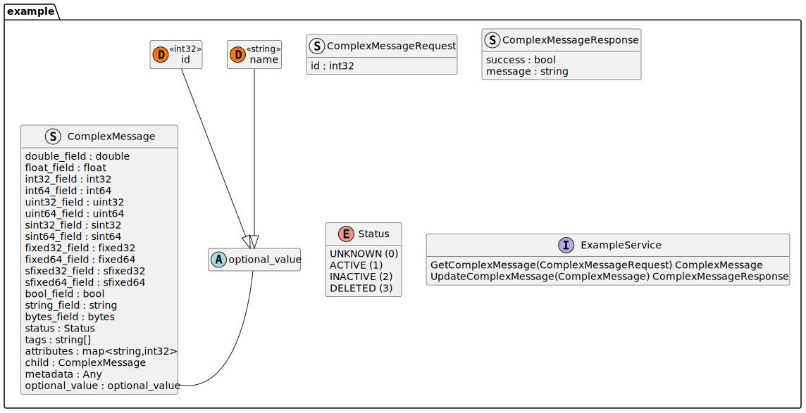

# protoc-gen-puml

This is a [Plantuml](https://plantuml.com/) diagram generator [plugin](https://protobuf.dev/reference/other/#plugins) for the [Google Protocol Buffers](https://protobuf.dev/) compiler (`protoc`). The plugin can generate `.puml` files based on your `.proto` files.

## Installation

As of today there are no prebuilt releases so you have to install from source:

```bash
go install github.com/cspengl/protoc-gen-puml/cmd/protoc-gen-puml@latest
```

## Usage

To use the plugin make sure that the plugin is available on your $PATH and called `protoc-gen-puml` (otherwise the protobuf compiler will not recognize the pluin). Then invoke the plugin together with the execution of `protoc` by adding an output directory for the diagram:

```bash
protoc --puml_out=. your_file.proto
```

This will generate a `.puml` file called `diagram.pb.puml`. To change the name of the output file you can provide the option `--puml_out=output=my_name.puml,:.`

## Example

```bash
protoc --puml_out=. testdata/test.proto
```

will generate:



## Mapping

Following table describes the mapping from protobuf to PlantUML as implemented by the plugin.

| **Protobuf**           | **PlantUML**             | **Example Source**                           | **Example Result**            | **Notes**                                  |
|------------------------|--------------------------|-----------------------------------------------|-------------------------------|--------------------------------------------|
| `double`               | `double`                 | `double v = 1;`                               | `v : double`                  | 64-bit floating point                      |
| `float`                | `float`                  | `float v = 1;`                                | `v : float`                   | 32-bit floating point                      |
| `int32`                | `int`                    | `int32 v = 1;`                                | `v : int`                     | Signed 32-bit int                          |
| `int64`                | `long`                   | `int64 v = 1;`                                | `v : long`                    | Signed 64-bit int                          |
| `uint32`               | `int`                    | `uint32 v = 1;`                               | `v : int`                     | Unsigned 32-bit int                        |
| `uint64`               | `long`                   | `uint64 v = 1;`                               | `v : long`                    | Unsigned 64-bit int                        |
| `sint32`               | `int`                    | `sint32 v = 1;`                               | `v : int`                     | ZigZag-encoded signed 32-bit int           |
| `sint64`               | `long`                   | `sint64 v = 1;`                               | `v : long`                    | ZigZag-encoded signed 64-bit int           |
| `fixed32`             | `int`                    | `fixed32 v = 1;`                              | `v : int`                     | Always 4 bytes                             |
| `fixed64`             | `long`                   | `fixed64 v = 1;`                              | `v : long`                    | Always 8 bytes                             |
| `sfixed32`            | `int`                    | `sfixed32 v = 1;`                             | `v : int`                     | Fixed size signed 32-bit                   |
| `sfixed64`            | `long`                   | `sfixed64 v = 1;`                             | `v : long`                    | Fixed size signed 64-bit                   |
| `bool`                | `boolean`                | `bool v = 1;`                                 | `v : boolean`                 | Boolean value                              |
| `string`              | `string`                 | `string v = 1;`                               | `v : string`                  | UTF-8 text                                 |
| `bytes`               | `bytes`                 | `bytes v = 1;`                                | `v : bytes`                  | Raw binary                                 |
| `enum`                | `enum`                   | `Status status = 1;`                          | `status : Status`             | User-defined enum type                     |
| `message`             | `struct`                  | `SubMessage child = 1;`                       | `child : SubMessage`          | Nested or external message reference       |
| `repeated <dtype>`     | `<dtype>[]`           | `repeated string tags = 1;`                   | `tags : string[]`         | Represents a list                          |
| `map<<ktype>, <vtype>>`  | `map<<ktype>, <vtype>>`   | `map<string, int32> attrs = 1;`               | `attrs : map<string, integer>`| Key-value mapping                          |

> `oneof` fields result in an abstract datatype having a extension for each possible type in the `oneof`.
